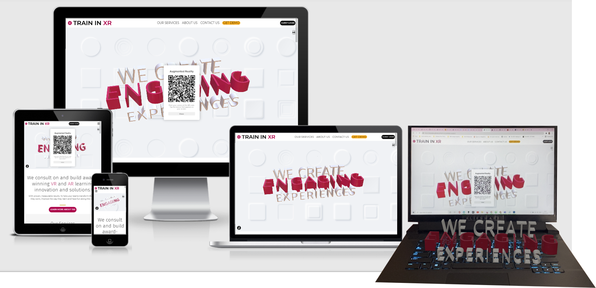

# Train in XR Website
[View the live project here](https://joyzadan.github.io/html-css-portfolio-project/)

Train in XR is a fictional advisory and consulting firm specialising in Extended Reality (Virtual Reality and Augmented Reality) services for workforce learning and development. Train in XR, or TXR for short, also offers inhouse VR and AR content development. TXR's services are geared for the enterprise, the public sector and medium to large companies.

## User Experience (UX)

### Train in XR Business Goals
As an advisory services firm, TXR helps companies and the public sectors understand:
* What is Virtual Reality (VR), what is Augmented Reality (AR) and how VR differs from AR
* The advantages of VR and AR in providing practical, engaging, and more cost-effective workforce training and development
* The key factors to consider when choosing the right technology stack and the right vendor(s) to implement VR/AR training

Train in XR's website aims to:
* Establish the company's credibility as expert providers of VR and AR services 
* Provide bite-size and easy to digest information that will help demystify VR and AR
* Provide access to whitepapers and case studies written by leading industry players and market practitioners
* Provide information about the best use cases of VR and AR for training
* Sell the company's advisory and consulting services to relevant markets
* Sell the company's inhouse VR and AR development services
* Become the leading source of insightful and unbiased information about the pros and cons of adapting VR and AR for workforce training 

### User Stories

#### First Time Visitor Goals
* As a First Time Visitor, I want to immediately understand what the website is all about.
* As a First Time Visitor, I want to be able to easily navigate around the website to find the information I'm looking for.
* As a First Time Visitor, I want to know that the company, Train in XR, has the experience, capability and credibility to provide the services they offer by being able to easily find information about other companies they are already working with.
* As a First Time Visitor, I want to be able to see testimonials from their clients.
* As a First Time Visitor, I want to know that they have suitable solutions for my industry sector.
* As a First Time Visitor, I would like to see samples of their work.
* As a First Time Visitor, I would like to be able to sign up for their newsletters and company announcements.

#### Returning Visitor Goals
* As a Returning Visitor, I want to be able to find out more information about Extended Reality, including: 
    - what is Virtual Reality
    - What is Augmented Reality
    - What are the use cases of VR and AR
    - How effective are VR and AR for staff training compared to other modalities
* As a Returning Visitor, I want to be able to find case studies on Virtual Reality and Augmented Reality.
* As a Returning Visitor, I want to be able to contact the team at Train in VR and schedule a virtual demo.
* As a Returning Visitor, I want to try out a TXR Augmented Reality experience.

#### Frequent Visitor Goals
* As a Frequent Visitor, I would like to be able to find out about any industry events that Train in XR is attending and to schedule a live demo meeting with their team.
* As a Frequent Visitor, I would like for me and my teams to be able to download a TXR AR App or demo.
* As a Frequent Visitor, I would like to be able to know more about Train in XR, their history and their track records in delivering their services.

#### Frequent Visitor (Client) Goals
* As a Frequent Visitor (Client), I want to be able to login to my TXR account.

### Design

* Colour Scheme
    - The main colours used on the Train in XR website are magenta purple and black. A complementary shade of vivid orange is also used for buttons on hover and on outro sections of the Services and About Us pages.
* Typography
    - Montserrat is main font used across the website with Fira Sans for emphasis and Sans-Serif as the fallback font. Montserrat and Fira Sans are often used together with the former known for being used frequently on technology sites.
* Imagery 
    Images and vector illustrations have been selected carefully for use across the site. The images used show computer generated imagery (CGI) common across VR and AR solutions. Other images also show learners from different industry sectors. The three vector illustrations used show the process of CGI creation, including a half mesh and half digital human.

### Wireframes

* Home Page Wireframe
* Services Page Wireframe
* Contact Us Wireframe
* Mobile Wireframe

## Features

## Technologies Used

### Languages Used
* HTML
* CSS
* JavaScript (on navigation)

### FRAMEWORKS, LIBRARIES AND PROGRAMMES USED
1. Vectary
2. Google Fonts
3. Font Awesome
4. Adobe Illustrator
5. Photoshop
6. Adobe Stock
7. Biteable
8. YouTube
9. Git
10. GitPod
11. GitHub
12. Balsamiq
13. Chrome DevTools
14. Microsoft Edge DevTools
15. Safari DevTools

### TESTING
* HTML Validator - [Results](https://validator.w3.org/nu/?doc=https%3A%2F%2Fjoyzadan.github.io%2Fhtml-css-portfolio-project%2F)
* CSS Validator - [Results](https://jigsaw.w3.org/css-validator/validator?uri=https%3A%2F%2Fjoyzadan.github.io%2Fhtml-css-portfolio-project%2F&profile=css3svg&usermedium=all&warning=1&vextwarning=&lang=en)
* Lighthouse - Results

### TESTING USER STORIES FROM USER EXPERIENCE (UX) SECTION

### FURTHER TESTING

### DEPLOYMENT

### CREDITS
#### Codes for Responsive NavBar
* Credit and thanks belong to tutorials on YouTube by @FlorinPop for his Responsive Navigation with Hamburger Menu - CSS and JavaScript Tutorial and @FollowAndrew for his Responsive Nav Bar Tutorial, both of which helped me put together the responsive navbar with hamburger menu and buttons.

### COPYRIGHT
