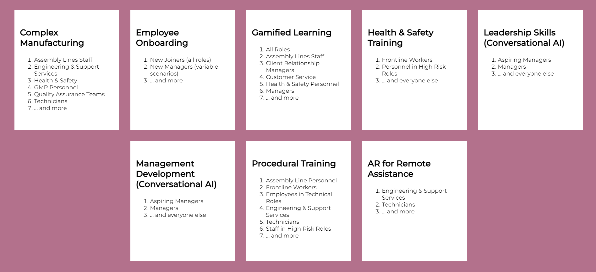

# Train in XR Website
[View the live project here](https://joyzadan.github.io/html-css-portfolio-project/)

Train in XR is a fictional advisory and consulting firm specialising in Extended Reality (Virtual Reality and Augmented Reality) services for workforce learning and development. Train in XR, or TXR for short, also offers inhouse VR and AR content development. TXR's services are geared for the enterprise, the public sector and medium to large companies.

## Table of Contents
1. Overview
2. User Experience (UX)
3. Features
4. Technologies Used
5. Testing
6. Deployment
7. Credits

## Overview
As an advisory services and VR/AR development firm, TXR helps companies, organizations and the public sectors understand:
* What is Virtual Reality (VR), what is Augmented Reality (AR) and how VR differs from AR
* The advantages of VR and AR in providing practical, engaging, and more cost-effective workforce training and development
* The key factors to consider when choosing the right technology stack and the right vendor(s) to implement VR/AR training

Below are some of the real-world challenges and problems that companies, organisations and the public sector face when it comes to workforce learning and development:

* In an article written by Dan Pontefract, a former Chief Learning Officer for Telus (10,000+ staff), and published on Forbes [The Wasted Dollars of Corporate Training Programs](https://www.forbes.com/sites/danpontefract/2019/09/15/the-wasted-dollars-of-corporate-training-programs/?sh=783e797971f9), it mentioned that in 2018, over $86.7 billion was spent on corporate training and development across the United States. Of that, a fair amount gets wasted for the following reasons: 
    - Learners' recall of the learning content depreciates over time (see article on employee development and the [Forgetting Curve](https://hbr.org/2019/10/where-companies-go-wrong-with-learning-and-development) published by Harvard Business Review).
    - Additionally, staff cannot attend a face to face training session and work at the same time. Their absence from work has a direct impact on the company's productivity for that time. 
    - In most cases, face to face training can also accommodate a small number of participants (average between 20 to 40 at most). Increasing these numbers can have a direct impact on a training session's effectiveness.

* In certain job roles, training staff on dangerous, high risk or diffifult to recreate situations such as surgical procedures, mining incident/ rescue training, fire safety, undersea-cable repairs, climbing at heights training - to name a few, due to the nature of the learning content, traditional training methods do fall short of being effective,realistic or practical and cost-effective.

What's the solution to the above challenges? Train in XR's Virtual Reality and Augmented Reality training solutions are able to solve real-world workforce learning and development challenges for companies, organizations and the public sector by providing more effective, highly engaging and more cost-effective learning solutions. See additional case studies on the effectiveness of VR as a learning solution [here](https://www.interplaylearning.com/blog/virtual-reality-increases-training-effectiveness-10-case-studies). 

Train in XR's website aims to:
* Establish the company's credibility as expert providers of VR and AR services 
* Provide bite-size and easy to digest information that will help demystify VR and AR
* Provide information on whitepapers and case studies written by leading industry players and market practitioners
* Provide information about the best use cases of VR and AR for training
* Sell the company's advisory, VR and AR development services to relevant markets
* Become the leading source of insightful and unbiased information about the pros and cons of adapting VR and AR for workforce training 
    
## User Experience (UX)
### User Stories

#### First Time Visitor Goals
* As a First Time Visitor, I want to easily understand the main purpose of the site and learn more about Train in XR.
* As a First Time Visitor, I want to be able to easily navigate around the website to find the information I'm looking for.
* As a First Time Visitor, I want to know that the company, Train in XR, has the experience, capability and credibility to provide the services they offer by being able to easily find information about other companies they are already working with.
* As a First Time Visitor, I want to be able to see testimonials from their clients.
* As a First Time Visitor, I want to know that they have suitable solutions for my industry sector.
* As a First Time Visitor, I would like to see samples of their work.
* As a First Time Visitor, I would like to be able to sign up for their newsletters and company announcements.

#### Returning Visitor Goals
* As a Returning Visitor, I want to be able to find out more information about Extended Reality, including: 
    - what is Virtual Reality
    - What is Augmented Reality
    - How effective are VR and AR for staff training compared to other modalities
    - What are the use cases of VR and AR
* As a Returning Visitor, I want to be able to find case studies on Virtual Reality and Augmented Reality.
* As a Returning Visitor, I want to be able to contact the team at Train in VR and schedule a virtual demo.
* As a Returning Visitor, I want to try out a TXR Augmented Reality experience.

#### Frequent Visitor Goals
* As a Frequent Visitor, I would like to be able to find out about any industry events that Train in XR is attending and to schedule a live demo meeting with their team.
* As a Frequent Visitor, I would like for me and my teams to be able to download a TXR AR App or demo.
* As a Frequent Visitor, I would like to be able to know more about Train in XR, their history and their track records in delivering their services.

#### Frequent Visitor (Client) Goals
* As a Frequent Visitor (Client), I want to be able to login to my TXR account.

### Design

* Colour Scheme
    - The main colours used on the Train in XR website are magenta purple and black. A complementary shade of vivid orange is also used for buttons on hover and on outro sections of the Services and About Us pages. The psychology of colour used on the website can be found [here](https://www.trajectorywebdesign.com/blog/web-design-color-psychology/).
* Typography
    - Montserrat is the main font used across the website with Fira Sans for emphasis and Sans-Serif as the fallback font. Montserrat and Fira Sans are often used together with the former known for being used frequently on technology sites.
* Imagery 
    - Images and vector illustrations were carefully selected for the site. The images used show computer generated imagery (CGI) examples common across VR and AR solutions. Other images also show learners from different industry sectors. The three vector illustrations used show the stages of a CGI development, from a face and a hand in mesh to a half mesh/ half digital human face and hand.

### Wireframes

* Home Page Wireframes 
* Mobile Wireframes 

## Features
* The Train in XR website is responsive on all device sizes, from the largest of viewports through to Galaxy Fold at 280vw.
* The website offers interactive elements from links and buttons across the site to drop down choices on the contact form on Contact Us page.
* Aside from the Home page, the site also has Services, About Us and Contact Us pages. Two additional pages are also available: a Login page for fictional clients and a Thank You landing page. The latter are for users who subscribed to receive updates, who registered to receive a demo and for users who wanted to contact a specific department such as Advisory, Sales, Finance, Technical Support and Recruitment.
* The site also offers interactive elements such as links, working forms and user controllable videos.
* The website also offers the users an interactive (movable) hero section on the Home page. The same Hero section, when the AR link is clicked, offers the users an Augmented Reality experience. See screenshots:

    1. Augmented Reality feature - access from desktop:  

    2. Augmented Reality feature - using an AR compatible mobile device: 

    3. Augmented Reality feature - AR at work, outside the house, overlaid on a car: 

## Technologies Used

### Languages Used
* HTML
* CSS3
* JavaScript (on navigation)

### Frameworks, Libraries and Programmes Used
1. Vectary
    * Vectary was used by the developer to create a simple Augmented Reality experience.
2. Google Fonts
    * Google fonts were used to import the Montserrat and Fira Sans fonts into the style.css file and are used on all pages of the website.
3. Font Awesome
    * Font Awesome icons were mainly used for the Footer section of the page, specifically for the social media links as well as the address details of the site.
4. Adobe Illustrator
    * Adobe Illustrator was used to create the two versions of the Train in XR SVG logos. Adobe Illustrator was also used to create the logos of fictional clients of Train in XR.
5. Photoshop
    * Photoshop was used to optimize images for TXR website such as file size compression and quality enhancement. Photoshop was also used to insert the screenshot of the TXR website with the Augmented Reality feature showing on the screen.
6. Adobe Stock
    * The developer has an existing account with Adobe Stock and all images used on the site are all licensed for use.
7. Biteable
    * A Biteable template was used to create the Train in XR corporate video for the About Us page.
8. YouTube
    * Two video contents from YouTube (CNBC and Future Business Tech) were embedded on the site as fictional TXR sample works. 
9. Git
    * Git was used for version control.
10. GitPod
    * GitPod was used as online IDE for GitHub and the terminal was used to add and commit to Git and push to GitHub.
11. GitHub
    * GitHub was and is being used as repository of the project source code.
12. Balsamiq
    * Balsamiq was used to create the wireframes for the Train in XR website project.
13. Chrome DevTools
    * Chrome DevTools was used to test the code and debug the code during the development process.
14. Microsoft Edge DevTools
    * Microsoft Edge DevTools was used to test the code and debug the code during the development process.
15. Safari DevTools
    * Safari DevTools was used to test the code and debug the code during the development process.

## Testing

At every stage of the development, testing were carried out to check for potential issues with the code, responsiveness, design and accessibility. I used the developer tools from Chrome, Safari and Microsoft Edge and Firefox.

### Bugs and Corrections
1. Problems with the navbar and the AR iframe overlapping and discovered that using CSS float property on the nav container with an iframe right below it was causinf the issue. The solution was to rewrite the code for the entire header area. This solution includes snippets of JavaScript code from FlorinPop (see Credits section for the screenshot of the borrowed code snippet). 
2. On one of my calls with my mentor, he raised the issues from the Nu Html Checker results such as:
    * button must not appear as descendant of the a element (these errors were on all the buttons on all pages except on the subscribe form)
    * errors from the YouTube videos iframe
    * indent errors and unclosed elements (navlinks error: no li element in scope but a li end tag seen)
   To fix the above, I removed the button tags from the a elements and applied CSS styling to the latter so the links look like buttons. I also fixed the YouTube videos iframe issues by deleting the frameborder and alt text properties. The indent errors and unclosed elements were also fixed by indenting the code uniformly and also removed the extra li closing tag.
3. On Firefox browser, the Book a Demo link on the navigation was not aligning with the rest of the navlinks. This was fixed by shortening the call to action from book a demo to Get Demo.
4. on Firefox, some of the text on homepage were misaligned. The text misalignment issues were fixed by replacing pixels with rem. I found this solution from watching Kevin Powell's YouTube video CSS tutorials. Please see the Credits section. 
5. Feedback from some family members and friends showed that on Firefox and on Safari, the front face and the backface text on the flipcards were overlapping. This was fixed by adding -moz and webkits autoprefixes.
6. Testing the site on Lighthouse showed issues with accessibility, performance and best practices such as wrong placement of the aria labels inside the Font Awesome icons links and focusable elements. This was fixed by moving said aria labels inside the a tags. Alt texts were also added inside the social media a tags and the hamburger menu icon. Lastly, missing keywords were added to the metatags on the header section of all the website pages.
7. W3C CSS Validation showed two missing units to paddings. This was quickly fixed by adding the missing units. Re-testing showed that all errors were gone.
8. W3C Markup Validation showed errors on YouTube video iframes. This was fixed by deleting the obsolete frameborder. 
9. W3C Markup Validation also showed warnings that the document is not mappable to XML 1.0 due to consecutive hyphens in a comment. These warnings were fixed by adjusting the comments above the code for all the sections of all the site pages.
10. Based on the feedback from the team at South Devon College, the following errors were corrected:
    * Fixed all the errors on the about us page (corporate video iframe) by deleting the alt text and the obsolete frameborder CSS property.
    * Removed the unnecessary script tags for libraries such as JQuery, Popper and Bootstrap.
    * Included in the Credits section the screenshots of the code snippets for the navigation menu from FlorinPop and for the use of rem instead of pixel that was learned from Kevin Powell's YouTube tutorials.
    * Renamed some of the assets (images) to remove capitalization to allow for cross-platform compatibility.
    * Tested the JavaScript code snippet on jslint.com and found errors because they do not test for arrow function (ES6). 

11. Added favicon to satisfy error warnings on Chrome DevTools console.
12. The navbar jumps slightly when hovering on the client login link. This was fixed by changing the padding sizes to be the same on normal state and on hover.
13. The backs and faces/ fronts of the flipcards on the services page were not aligned. The bug was caused by a 1rem padding on the media queries for min-280px screen sizes. This was fixed by deleting the errant 1rem padding.

### Validation Results
The W3C Markup Validator and the W3C CSS Validator were used to test and validate every all six pages of the Train in XR site project to ensure that there were no syntax errors in the code. Chrome's Lighthouse DevTool was also used to test for Performance, Accessibility, Best Practices and SEO.
* W3C Markup Validator - [Results](https://validator.w3.org/nu/?doc=https%3A%2F%2Fjoyzadan.github.io%2Fhtml-css-portfolio-project%2F) 
* W3C CSS Validator - [Results](https://jigsaw.w3.org/css-validator/validator?uri=https%3A%2F%2Fjoyzadan.github.io%2Fhtml-css-portfolio-project%2F&profile=css3svg&usermedium=all&warning=1&vextwarning=&lang=en) 
* Lighthouse 
* a11y Color Contrast Accessibility for the Visually Impaired Validator 
    - Home Page Test Results 
    - Services Page Test Results 
    - About Us Page Test Results 
    - Contact Us Page Test Results 

### Testing User Stories from User Experience (UX) Section

* First Time Visitor Goals
    - As a First Time Visitor, I want to easily understand the main purpose of the site and learn more about Train in XR
        - Upon entering the site, users are greeted with a call to action (CTA) beneath the navigation bar to try out an Augmented Reality experience by clicking on the AR activation icon. 
        - Beneath the CTA is a clean and fast loading interactive Hero section that users can move in circles, side to side, and up and down. 
        - Beneath the Hero section, the users can scroll down to learn more about Train in XR. 
    - As a First Time Visitor, I want to be able to easily navigate around the website to find the information I'm looking for.
        - Upon first visiting the site, the users are greeted with a clean and descriptive navigation bar to go to the page of their choice. 
        - Users are able to navigate across different pages of the site which clearly convey the information they will find. On every page of the site are strategically placed call to actions which are also clearly labelled and link to expected content. 
    - As a First Time Visitor, I want to know that the company, Train in XR, has the experience, capability and credibility to provide the services they offer by being able to easily find information about other companies they are already working with.
        - At various intervals across the site, users are provided content which showcases the company's experience, capabilities and credibility to provide the advisory services and VR and AR development. On the Home page, users are given three main services that the company provides: Advisory Consulting, VR and AR Content Development and Learning & Development Transformation. 
        
        - Sample works are also available on the Home page and are immediately followed by logos of the companies which TXR works with. (These logos are created specifically for this project and are purely fictional.) 
    - As a First Time Visitor, I want to be able to see testimonials from their clients.
        - Two testimonials from clients are also available for the users to see. These include the names, job titles and the organization of the clients who provided their testimonials. 
    - As a First Time Visitor, I want to know that they have suitable solutions for my industry sector.
        - On the Services page, the content are divided into three categories: the Advisory & Consulting services of the company, the VR and AR services they offer by industry sector and company's VR and AR services by Use Cases.  
    - As a First Time Visitor, I would like to see samples of their work.
        - Upon entering the site, users are able to immediately see a sample of TXR's work - The Hero section of the Home page is a fully-functioning AR experience. At the click of a button, a user can try out AR. See Features Section detailing the Augmented Reality feature available on the site for users to experience the company's sample work.
        - Sample works are also available on the Home page. 
        - Users are also provided samples of work that the company has delivered which include: Computer Generated Imagery (CGI) 3D Environment/ digital twin of a hospital examination room with various medical equipment; a video showing VR specific content and another video specific to AR.
        - On the Services page within the Services by Industry section, images of other 3D digital twins are also available for the users to view.
    - As a First Time Visitor, I would like to be able to sign up for their newsletters and company announcements.
        - A Subscribe to Receive Updates form is made available on the site's Home page, above the Footer. 
        - A thank you landing page also greets users after successfully signing up to receive the company's updates. 

* Returning Visitor Goals
    -   As a Returning Visitor, I want to be able to find out more information about Extended Reality, including: 
        - what is Virtual Reality
            - On the Home page, Users are provided the answer to this often asked question.
        - What is Augmented Reality
            - On the Home page, Users are provided the answer to this often asked question.
        - How effective are VR and AR for staff training compared to other modalities
            - On the Home page, the effectiveness of both VR and AR is clearly communicated with specific numbers and percentages in terms of training improvement and job performance of learners following using VR and/or AR for training. 
        - What are the use cases of VR and AR
            - Users are provided information about the Use Cases of VR and of AR for each industry sector and for which job roles are they more suitable for. See also screenshot above. 
    - As a Returning Visitor, I want to be able to find case studies on Virtual Reality and Augmented Reality.
        - On the Home page, Users are provided the results of specific case studies conducted by PwC and by CapGemini on the effectiveness of Virtual Reality and Augmented Reality in improving staff performance and training. See previous screenshot above.
    - As a Returning Visitor, I want to be able to contact the team at Train in VR and schedule a virtual demo.
        - Across all the pages of the site, users are able to click on various call to actions to contact team TXR and book a demo.
        - On the Contact Us page, the users are able to find the fictional phone number of TXR's Customer Service team to schedule a demo.
        - Also on the Contact Us page, a form is available for the user to complete with an option to choose between VR and AR when they are booking a demo. 
    - As a Returning Visitor, I want to try out a TXR Augmented Reality experience.
        - On the Homepage, users are able to try out an AR experience by clicking on the AR icon/ button on the top right side of the screen. 
        - The option to try out an AR experience is seamless and user-friendly, no signup is required. All users need to do is click a button using their AR compatible device. See Features section for screenshots.

* Frequent Visitor Goals
    - As a Frequent Visitor, I would like to be able to find out about any industry events that Train in XR is attending and to schedule a live demo meeting with their team.
        - A list of events that TXR will be attending and presenting at is included on the About Us page.
        - A call to action link is also included to provide the user the option to book a face to face demo meeting at said events, ahead of time. 
    - As a Frequent Visitor, I would like for me and my teams to be able to download a TXR AR App or demo.
        - A link to download an AR App is included on the sample of our works section.
    - As a Frequent Visitor, I would like to be able to know more about Train in XR, their history and their track records in delivering their services.
        - The About Us page provides the users more information about Train in XR, its track record to date as well as its brief history.
        - A corporate video about the company is also available on the About Us page. 

* Frequent Visitor (Client) Goals
    - As a Frequent Visitor (Client), I want to be able to login to my TXR account.
        - Clients of TXR are able to login to their account via signup page. The link to the page is available on the site navigation bar for desktop and tablet versions of the site. 

### Further Testing
* The Train in XR website was tested on Google Chrome, Microsoft Edge and Safari DevTools for errors on code,  responsiveness and features support.
* The website was viewed and tested for responsiveness and features working on Alienware desktop, on several MacBooks (2012, 2014, 2017 and 2020), and on a low-end Dell laptop. 
* The site was also viewed and various mobiles and tablets, from the newest to the oldest ipad (2011) that the developer has access to again test for responsiveness and features working.
* The website was also tested for the Augmented Reality and the flip cards features both on desktops and on mobiles.
* The site navigation, links and buttons were tested multiple times to ensure that there are no broken links.
* Friends, family members and industry contacts were also asked to review the site and to share with the developer any broken links, bugs or user experience issues they may encounter.

## Deployment
### GitHub Pages
* The project was deployed to GitHub Pages using the following steps:
1. Log in to GitHub and locate the [GitHub Repository](https://github.com/JoyZadan/html-css-portfolio-project)
2. On the repository page, navigate to Settings and click on it
3. Within the Settings page, on the left hand side, scroll down until you see Pages (second to the last), click on it
4. On GitHub Pages page, under Source, choose Branch:main, then /root and click Save
5. After about a minute, the site is published.

## Credits
### Code
* Credit and thanks belong to tutorials on YouTube by @FlorinPop for his [Responsive Navigation with Hamburger Menu - CSS and JavaScript tutorial](https://www.youtube.com/watch?v=ydZc17rlR5E) and @FollowAndrew for his [Responsive NavBar tutorial](https://www.youtube.com/watch?v=6pidsgeLLzE&t=891s), both of which helped me put together the responsive navbar with hamburger menu and buttons. Kevin Powell's YouTube tutorial on [CSS units](https://www.youtube.com/watch?v=N5wpD9Ov_To) helped me understand the benefits of using rem instead of pixels for a more responsive website.
    - [JS code snippet from FlorinPop](/assets/images/code-snippets/js-hamburger-menu.png)
    - [CSS units code snippets](/assets/images/code-snippets/code-snippets-influenced-by-kevin-powell.png)

### Content
* All of the content for the project was written by the developer.
* The Code Institute README sample served as a guide for this project's README. 

### Augmented Reality
* The Augmented Reality experience was created by the developer using Vectary

### Media
* All images were licensed from Adobe Stock
* The YouTube videos came from CNBC and Future Business Tech

### Acknowledgement
* Thanks to Code Institute's highly effective teaching method and the user-friendly LMS, both of which combined make for a pleasurable learning experience. Also thanks to Conrad Saunders at South Devon College for his time and insights into the project assessment criteria. Special mention and thanks to my mentor, Dario Carrasquel, for his support, invaluable insights and for also not hesitating to advise that I may want to pare down my ideas and focus my priorities to the critical and the essential parts of this project's development.
